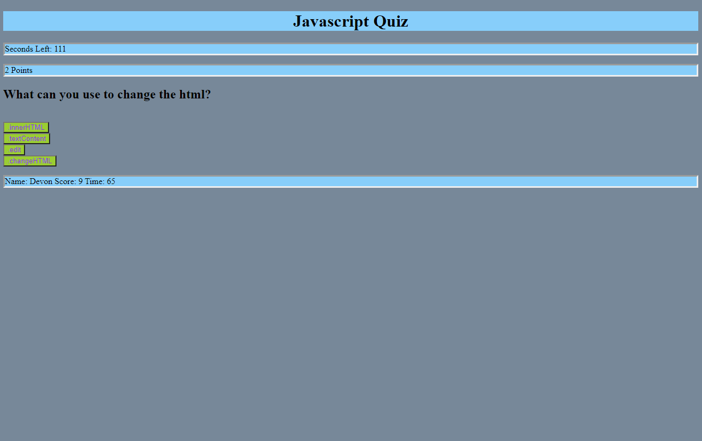

# jsQuiz
[Lives Here](https://github.com/devonp702/jsQuiz)
[Deployed Here](https://devonp702.github.io/jsQuiz/)

## Page Introduction
This is a quiz to test your knowledge of Java Script. It will give you two minutes to answer as many questions as possible. A correct answer will give you a point, an incorrect answer will give you a time penalty. Leave your name and high-score at the end.

## Goals
* make each question an object in an array
* click start button to start game
* timer counts down
* function for handling objects and displaying data on screen
* function for keeping score.
* end game and save score.